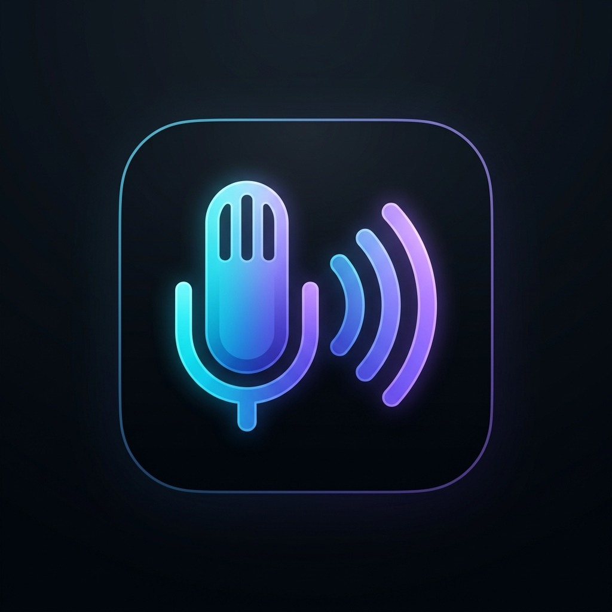

<div align="center">

  

  # Nexora Voice Studio

  **Private, ultra-low-latency offline voice-to-text dictation for Windows.**  
  *Powered by local Whisper models, Vulkan GPU acceleration, and Tauri v2.*

  <br />

  [](LICENSE)
  [](https://tauri.app)
  [](https://www.rust-lang.org)
  [](https://react.dev)
  [](https://www.vulkan.org)
  [](https://microsoft.com)

</div>

---

## 🌟 Overview

**Nexora Voice** is an open-source, local-first voice dictation studio engineered for speed, privacy, and frictionless developer productivity. It listens when triggered by a global hotkey and directly types recognized speech into whatever text editor, IDE, terminal, or browser window you are working in.

Unlike cloud-dependent dictation tools, **Nexora Voice processes 100% of your audio locally on your machine**. Your voice never leaves your hardware, eliminating privacy concerns, API subscriptions, and network latency.

---

## ✨ Key Features

* 🔒 **100% Local & Zero-Egress Privacy**: Whisper neural networks execute entirely on your machine. Zero cloud telemetry, zero remote audio streaming.
* ⚡ **Vulkan GPU Acceleration**: Powered by `whisper.cpp` with native Vulkan backend bindings, delivering sub-second real-time transcription speeds (RTF < 0.2x on modern GPUs).
* 🎙️ **Continuous Streaming Pipeline**: Speak naturally without awkward pauses. Our in-memory chunk recorder and sequential transcript assembler eliminate dropped or repeated words across segment boundaries.
* 🎯 **Three Curated Model Profiles**:
  * ⚡ **Fast (English)**: *Distil-Whisper Large-v3* — Lowest latency, ideal for rapid coding prompts and real-time messaging.
  * ⚖️ **Balanced (Multilingual)**: *Whisper Large-v3 Turbo* — Optimal blend of high accuracy and multi-language capability (Default).
  * 💻 **Lightweight (English)**: *Whisper Small (English)* — Ultra-compact memory footprint (~460 MB) for budget GPUs or laptop battery life.
* 🎨 **Minimalist Floating Capsule Overlay**:
  * Seamless, non-intrusive floating HUD displaying live audio waveform springs.
  * Dual design modes: **Dark Mode** (Glowing Neon Cyan) and **Light Mode** (Frosted White Glass).
* ⌨️ **System-Wide Text Injection**: Press <kbd>Ctrl</kbd> + <kbd>Alt</kbd> + <kbd>V</kbd> (configurable) anywhere to dictate directly into Cursor, VS Code, Slack, Notion, Word, or terminal sessions.
* 📊 **Built-In Studio Dashboard**: Manage microphone input devices, download/delete model checkpoints with corruption verification, view transcription history, and inspect real-time performance analytics.

---

## 🏗️ Architecture

```
[ Microphone Capture ]
          │ (cpal 16kHz mono)
          ▼
[ Chunked In-Memory Audio Buffer ]
          │ (direct RAM slice)
          ▼
[ WhisperEngine (whisper.cpp + Vulkan) ]
          │ (token inference)
          ▼
[ Sequential Transcript Assembler ]
          │ (fuzzy overlap deduplication)
          ▼
[ System Text Injector (enigo) ] ──► Types directly into Active Window
```

---

## 📋 Prerequisites

To run or build Nexora Voice from source on Windows:

* **Windows 10 / 11** (64-bit)
* **Vulkan-capable GPU** (NVIDIA, AMD, or Intel) with up-to-date GPU drivers
* **[Node.js](https://nodejs.org/)** (v18 or higher) & `npm`
* **[Rust](https://www.rust-lang.org/tools/install)** (stable toolchain)
* **[CMake](https://cmake.org/download/)** (v3.16 or higher, added to system `PATH`)
* **[Visual Studio C++ Build Tools](https://visualstudio.microsoft.com/visual-cpp-build-tools/)** (MSVC compiler & Windows SDK)
* **[Vulkan SDK](https://vulkan.lunarg.com/sdk/home)** (Recommended for building `whisper-rs` Vulkan backend)

> [!IMPORTANT]
> **Windows Long Paths**: C++ compilation of deep shader files can exceed the Windows 260-character path limit. Ensure long paths are enabled:
> ```powershell
> git config --system core.longpaths true
> ```
> And verify `LongPathsEnabled` is set to `1` in Windows Registry (`HKLM\SYSTEM\CurrentControlSet\Control\FileSystem`).

---

## 🚀 Getting Started (Development)

1. **Clone the repository**:
   ```bash
   git clone https://github.com/gautamcoder235/Nexora-Voice.git
   cd Nexora-Voice
   ```

2. **Install Node dependencies**:
   ```bash
   npm install
   ```

3. **Launch the development app**:
   ```bash
   npm run tauri dev
   ```
   *The first launch will initialize the local Whisper engine and prompt you to load or download your preferred model profile.*

---

## 📦 Building Production Binaries

To compile an optimized installer (`.exe` / `.msi`):

```bash
npm run tauri build
```

The compiled binaries will be output to:
```
src-tauri/target/release/bundle/msi/
src-tauri/target/release/bundle/nsis/
```

---

## ⌨️ Default Shortcuts

| Action | Default Hotkey | Configurable |
| :--- | :--- | :---: |
| **Start / Stop Dictation** | <kbd>Ctrl</kbd> + <kbd>Alt</kbd> + <kbd>V</kbd> | Yes |
| **Cancel Dictation** | <kbd>Escape</kbd> | Yes |
| **Open Studio Dashboard** | <kbd>Ctrl</kbd> + <kbd>Alt</kbd> + <kbd>S</kbd> | Yes |
| **Toggle Formatting Mode** | <kbd>Ctrl</kbd> + <kbd>Alt</kbd> + <kbd>F</kbd> | Yes |

*All shortcuts and injection behaviors can be customized anytime from the Settings Dashboard.*

---

## 📁 Repository Structure

```
Nexora-Voice/
├── .github/                   # GitHub Actions workflows & issue templates
├── public/                    # Static branding and icon assets
├── src/                       # React frontend (Vite, TypeScript, Tailwind)
│   ├── components/            # Studio Dashboard, Overlay, History, Settings
│   └── App.tsx                # Frontend orchestrator
├── src-tauri/                 # Rust native backend (Tauri v2)
│   ├── src/
│   │   ├── audio.rs           # CPAL audio recording stream
│   │   ├── chunked_recorder.rs# Real-time memory buffer chunker
│   │   ├── commands.rs        # Tauri IPC invoke commands
│   │   ├── history.rs         # SQLite / JSON history storage
│   │   ├── injector.rs        # OS keyboard event simulation
│   │   ├── model_manager.rs   # Safe download, cache, & deletion manager
│   │   ├── transcript_assembler.rs # Fuzzy deduplication assembler
│   │   ├── whisper_service.rs # whisper.cpp Vulkan runtime wrapper
│   │   └── lib.rs             # Tauri lifecycle & global shortcut loop
│   └── Cargo.toml             # Rust dependencies & build configuration
└── package.json               # Node workspace configuration
```

---

## 🤝 Contributing

Contributions, bug reports, and feature suggestions are warmly welcomed! Please read [CONTRIBUTING.md](CONTRIBUTING.md) to understand our development workflow and coding standards before opening a pull request.

Please note that this project adheres to the [Code of Conduct](CODE_OF_CONDUCT.md).

---

## 🛡️ Security

For vulnerability disclosures or security questions, please review our [Security Policy](SECURITY.md).

---

## 📄 License

This project is licensed under the **MIT License** - see the [LICENSE](LICENSE) file for details.

---

<div align="center">
  <sub>Built with ❤️ by <a href="https://github.com/gautamcoder235">Gautam Sharma</a></sub>
</div>
